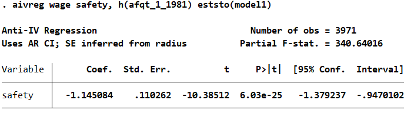
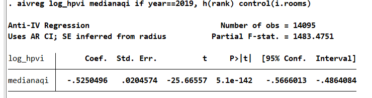
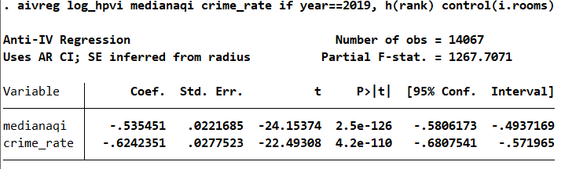

# ReadMe File for aivreg Stata Package
The Stata **aivreg** command implements the anti-IV method used in [Bell (2022)](https://papers.ssrn.com/sol3/papers.cfm?abstract_id=4173522), [Bell, Calder-Wang, and Zhong (2023)](https://papers.ssrn.com/sol3/papers.cfm?abstract_id=4565093), and [Bell et.al (2024)](https://papers.ssrn.com/sol3/papers.cfm?abstract_id=4899974).

## Installation
- Download **aivreg.ado** and **aivreg.sthlp** from this repository
- In Stata, type in _sysdir_, find the directory listed as _PERSONAL_
- Put **aivreg.ado** and **aivreg.sthlp** in the _PERSONAL_ directory

## Syntax
 **aivreg** depvar varlist [if] [in], h(varlist) [control(string)] [fe(varlist)] [weight(string)] [eststo(string)] [vce(string)] [reps(string)] [seed(string)] [cluster(varlist)]

## Input List
 - **depvar** the outcome variable 
 - **varlist** the list of amenities 
 - **h** a list of anti-IV variables (currently aivreg only supports one anti-IV variable) 
 - **control** specify the list of control variables
 - **fe** list of fixed effects to be absorbed; if used, ivreghdfe or reghdfe is called instead of ivreg2 or reg
 - **weight** specifies weighting options; if specified, you should include the full weighting statement, e.g.: weight([w=wt]) 
 - **eststo** specifies the model name to store the estimates under
 - **vce** specify standard error estimation: Anderson-Rubin is the default; boot computes bootstrapped SE; asymp uses the SE of ivreg2 or ivreghdfe
 - **reps** number of repetitions (for bootstrap only)
 - **seed** seed for bootstrap (for bootstrap only)
 - **cluster** cluster variables for standard errors; not available for Anderson-Ruben standard errors
 - **savefirst** when set to savefirst, the first stage regression is reported; this is also saved in eststo as _ivreg2_`h'
## Return List
 - **Partial F** Partial F-Stat; this does not appear in all cases yet
 - **Coef.** Coefficient for the amenity "var" 
 - **Std. Err.** Standard error of the coefficient (in Anderson-Rubin case, this is approximated from the confidence interval)
 - **t** t-statistic estimate of the coefficient
 - **P>|t|** p value based on the t-statistic
 - **[95% Conf. Interval]** 95% confidence interval for the coefficient

## Examples
### Example 1: Job Safety
- Exercepted from [Bell (2022)](https://papers.ssrn.com/sol3/papers.cfm?abstract_id=4173522)
- Import accompanying labor market data. Wage is the outcome variable, safety is the amenity to be priced, and AFQT score is the anti-IV variable of choice.
  - **use safety_aivreg_example, clear**
- Naive hedonic regression
  - **reg wage safety**
  -  
- Hedonic regression with AFQT as control
  - **reg wage safety afqt_1_1981**
  -  
- Apply the Anti-IV method using AFQT as anti-IV with the command, storing the estimated results as model1.
  -  **aivreg wage safety, h(afqt_1_1981) eststo(model1)**
  -  

### Example 2: Housing Amenities
- Excerpted from [Bell, Calder-Wang, and Zhong (2023)](https://papers.ssrn.com/sol3/papers.cfm?abstract_id=4565093)
- Import accompanying housing market data. Log House Price Index(log_hpvi) is the outcome variables, crime_rate and medianaqi (Air Quality Index, higher means worse air) are the amenities to be priced, and rank (Geographic PageRank from migra w) is the anti-IV variable of choice.
  -  **use housing_aivreg_example, clear**
- Single-amenity hedonic regression with geographic PageRank as controls to price air quality
  -  **reg log_hpvi medianaqi rank i.rooms if year==2019**
  -  
- Pricing a single housing amenity, air quality, using the aivreg command, with geographic PageRank as aivreg, controlling for room fixed effects; storing the estimates as model2
  -  **aivreg log_hpvi medianaqi if year==2019, h(rank) control(i.rooms) eststo(model2)**
  -  
- Simultaneously pricing multiple housing amenities, air quality and crime_rate, using the aivreg command, with geographic PageRank as anti-IV, controlling for room fixed effects; 
  -  **aivreg log_hpvi medianaqi crime_rate if year==2019, h(rank) fe(i.rooms)**
  -   
- Export the aivreg results using esttab
  -  **esttab model1 model2, mgroup("aivreg results" "aivreg results", pattern(1 1)) modelwidth(25) varwidth(20) label**
  -  

## Reference
-  Bell, Alex, [Job Amenities and Earnings Inequality](https://papers.ssrn.com/sol3/papers.cfm?abstract_id=4173522) (July 26, 2022). Available at SSRN: https://ssrn.com/abstract=4173522 or http://dx.doi.org/10.2139/ssrn.4173522
-  Bell, Alex, Sophie Calder-Wang, and Shusheng Zhong, [Pricing Neighborhood Amenities: A Proxy-Based Approach](https://papers.ssrn.com/sol3/papers.cfm?abstract_id=4565093). Mimeo, 2023.
-  Bell, Alex, Stephen B. Billings, Sophie Calder-Wang, and Shusheng Zhong, [An Anti-IV Approach for Pricing Residential Amenities: Applications to Flood Risk](https://papers.ssrn.com/sol3/papers.cfm?abstract_id=4899974). Mimeo, 2024.
-  Correia, Sergio, IVREGHDFE: Stata module for extended instrumental variable regressions with multiple levels of fixed effects. Mimeo, 2018

